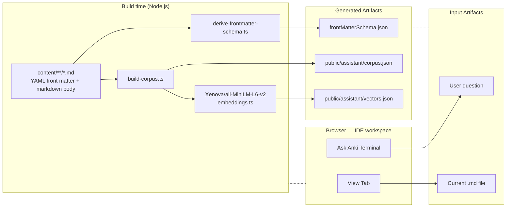
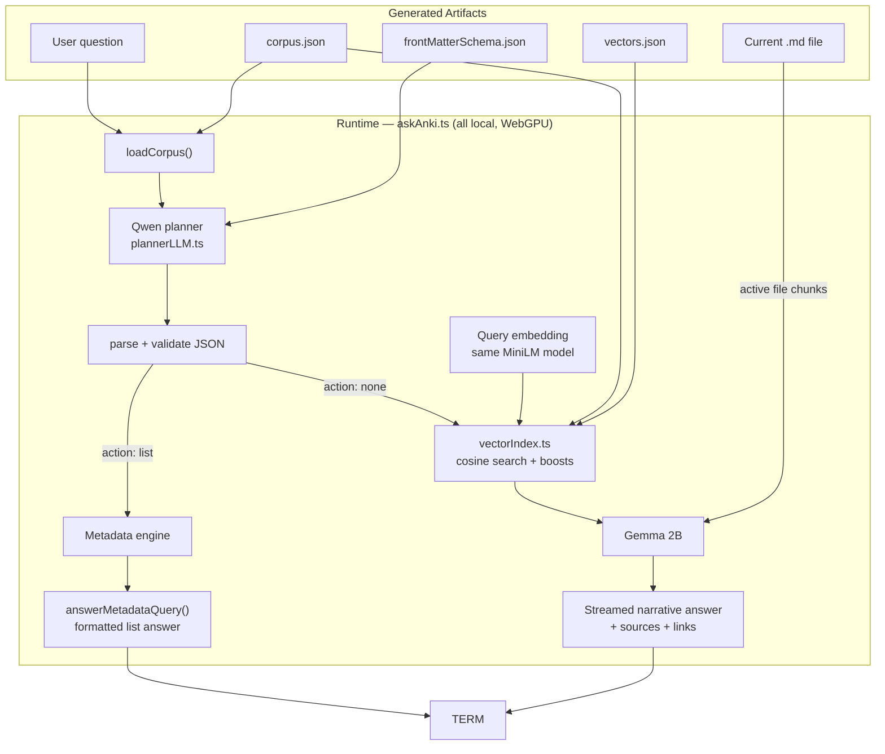
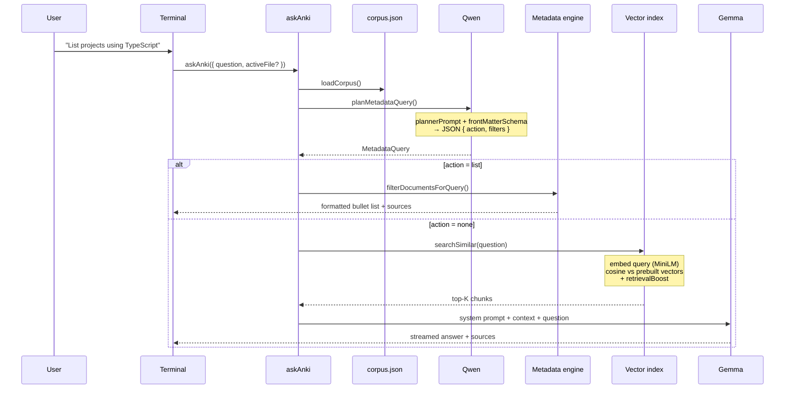
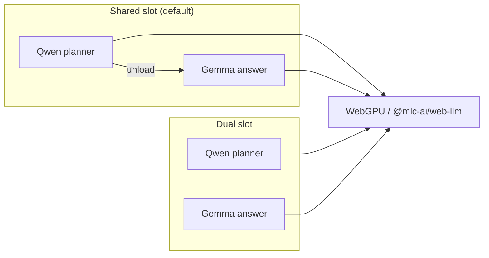

# anki.fyi architecture

Markdown-backed IDE workspace with **Ask Anki**: local retrieval-augmented generation using build-time embeddings and in-browser WebLLM models (Qwen + Gemma). No cloud LLM APIs.

## High-level overview

Build outputs (`corpus.json`, `vectors.json`, `frontMatterSchema.json`) are written at compile time and consumed by the browser at query time. The diagrams below are separate — no arrows between build and runtime.

### Build time



### Runtime


## Content layer

| Piece | Role |
|--------|------|
| `content/**/*.md` | Source of truth — projects, experience, concepts, analytics, etc. |
| YAML front matter | Structured metadata: `kind`, `technologies`, `company`, `importance`, `tags`, … |
| `lib/assistant/frontMatter.ts` | Parses and normalizes front matter at build time |
| `lib/assistant/chunking.ts` | Splits each doc into a **metadata chunk** plus **section chunks** (filmstrip day headings, word limits) |

## Build pipeline

Regenerate after content changes:

```bash
pnpm build:corpus
pnpm derive:frontmatter-schema   # when front matter shape changes
```

```
content/*.md
    │
    ├─ gray-matter parse
    ├─ buildCorpusDocument() → documents[] + chunks[]
    ├─ SHA corpusHash
    │
    ├─► corpus.json   { documents, chunks, corpusHash }
    └─► vectors.json  { chunkId → embedding[] }  (MiniLM, build-time only)
```

| Script | Output |
|--------|--------|
| `scripts/build-corpus.ts` | `public/assistant/corpus.json`, `public/assistant/vectors.json` |
| `scripts/derive-frontmatter-schema.ts` | `lib/assistant/generated/frontMatterSchema.json` |

## Static artifacts

### `corpus.json`

- `documents[]` — full metadata plus chunk references (used for metadata filtering)
- `chunks[]` — text slices with `id`, `path`, `section`, etc.
- `corpusHash` — content fingerprint shared with vectors

### `vectors.json`

- Precomputed embeddings per `chunkId`
- Must share `corpusHash` with corpus (mismatch throws at load time)

## Ask Anki runtime

Entry point: `lib/assistant/askAnki.ts`  
UI: `components/workspace/AskAnkiTerminal.tsx`



### Path A — Metadata (Qwen only)

For catalog and enumeration questions: *"list all projects"*, *"flagship projects"*, *"Oracle experience"*, *"what analytics files"*.

1. **Qwen** (`Qwen2.5-0.5B/1.5B` via WebLLM) reads a compact system prompt and few-shot examples (`plannerPrompt.ts`).
2. Outputs JSON → **`metadataQueryValidate.ts`** (repairs common mistakes: `actions`→`filters`, missing `action`, malformed JSON).
3. **`metadataQueryEvaluate.ts`** runs filters (`eq`, `containsAll`, `exists`, …) on `documents[]`.
4. **`metadataQuery.ts`** formats a list answer — no vector search, no Gemma.

### Path B — RAG (vectors + Gemma)

For narrative questions: *"Why did you build Lintern?"*, *"What did you do at Oracle?"*.

1. Qwen returns `{ action: "none" }` (or planner fails → same fallback).
2. **`vectorIndex.ts`** loads corpus + vectors, embeds the question in-browser, ranks chunks by cosine similarity.
3. **`retrievalBoost.ts`** nudges scores by intent (project vs experience, etc.).
4. **`profileGuard.ts`** may refuse off-topic questions (low similarity).
5. **`activeFileContext.ts`** pins the open editor file into context when relevant.
6. **Gemma 2B** generates an answer from retrieved chunks plus system prompt (`prompt.ts`).
7. **`answerLinks.ts`** enriches the response with workspace links.

## Models and WebLLM slots



| Model | When | Purpose |
|--------|------|---------|
| **MiniLM** (`Xenova/all-MiniLM-L6-v2`) | Build + query embed | Semantic retrieval only |
| **Qwen 0.5B/1.5B** | Every question first | JSON metadata planner |
| **Gemma 2B** | RAG path only | Natural-language answers |

Terminal UI: **WebLLM slot** toggle (`shared` vs `dual`) in `PlannerEngineModeControl.tsx`, persisted via `plannerEngineMode.ts`.

- **`shared`**: unload Qwen after planning before loading Gemma (lower VRAM).
- **`dual`**: keep Qwen loaded alongside Gemma (faster repeat metadata queries).

## Key files

| Layer | Files |
|--------|--------|
| Orchestration | `lib/assistant/askAnki.ts` |
| Planner | `lib/assistant/plannerLLM.ts`, `lib/assistant/plannerPrompt.ts` |
| Metadata | `lib/assistant/metadataQueryTypes.ts`, `metadataQueryValidate.ts`, `metadataQueryEvaluate.ts`, `metadataQuery.ts` |
| Retrieval | `lib/assistant/vectorIndex.ts`, `embeddings.ts`, `retrievalBoost.ts` |
| Generation | `lib/assistant/modelProvider.ts`, `prompt.ts` |
| Build | `scripts/build-corpus.ts`, `scripts/derive-frontmatter-schema.ts` |
| Config | `lib/assistant/config.ts` |
| UI | `components/workspace/AskAnkiTerminal.tsx`, `components/workspace.tsx` |

## Mental model

**Markdown → chunked corpus + vectors at build time; at query time Qwen tries structured metadata first, otherwise MiniLM retrieval + Gemma answers from chunks — all in the browser.**

## Editing this diagram

This file uses [Mermaid](https://mermaid.js.org/) diagrams. Edit the fenced `mermaid` blocks directly, or paste them into [Mermaid Live Editor](https://mermaid.live) to preview and export PNG/SVG.
